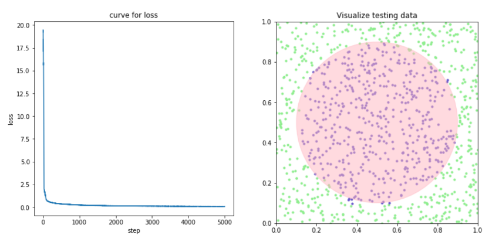

This is the code of EPFL master course Deep learning(mini project2), which is a basic (or to be called--toy) framework for a neural network library.

In the code, the basic linear layer, the activation layer and the loss layer was implemented by pure pytorch matrix operator.

It is a great material if you want to learn the backpropagation. Since the pytorch matrix operator supports GPU computation natively, this code can also perform GPU training.

Here is the result when we use the neural network to find a boundary of the circle (with the generated circle toy dataset).
Of course you can try a lot of things on your own (Maybe even try the MNIST classification! Since you can use the GPU if you have one, this code is not very slow compared with existing library such as keras!!!)

There are two branches, the master branch is the fast version which is implemented by batch computation and a without_batch branch which is done by samples by samples. The batch compute version is way faster than the without_batch version, but the without_batch version has a more intuitive math process of backpropagation. It is more easy to understand.

The pdf file is the report of the project, which provides an explanation of implementing the backpropagation with batch computation.

The work is done by Xingce BAO, Xi FAN and Danjiao MA.

